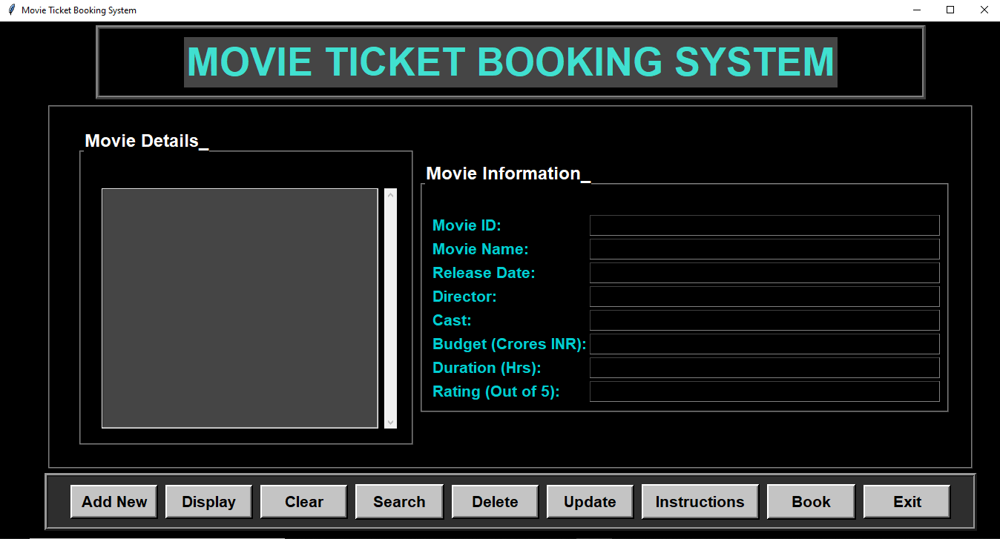
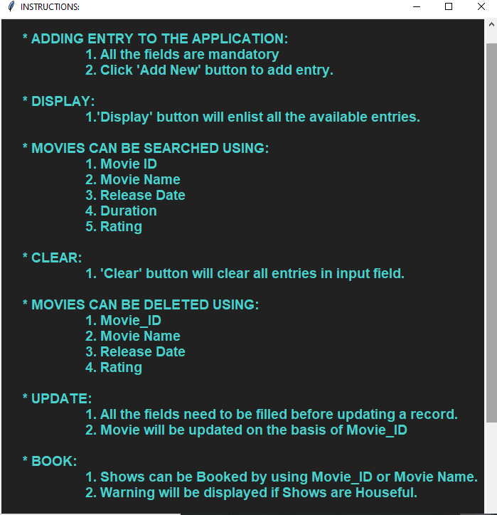

### Movie Booking Application

* Basic application useful for understanding the python tkinter library and SQL.
#### Options available on UI: 

    1. Insert new movie.
    2. Display all records.
    3. Clear input fields.
    4. Search movie record.
    5. Delete movie record.
    6. Update movie record.
    7. Book a movie.
    8. General instructions.
    9. Exit

    
    
    
    

### Pre-requisites

1. Python (version 3.0.0 or above)
2. tkinter
3. sqlite

### Reference

* Link: https://github.com/Sid-149/DBMS-Movie-Ticket-Booking-System
